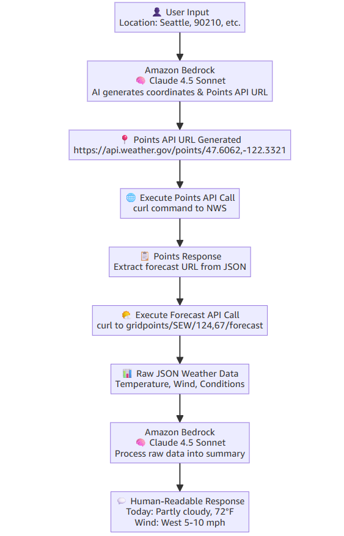
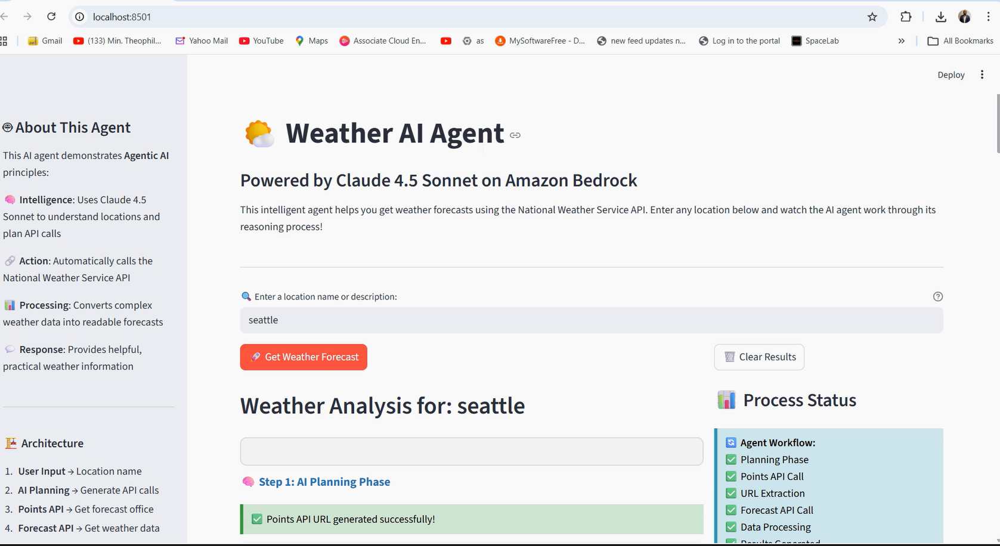
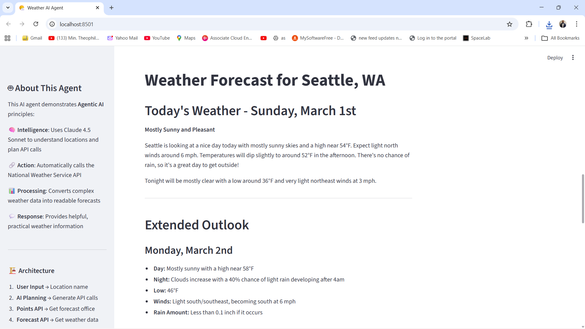

# Weather AI Agent 🌤️🤖

A Level 100, beginner-friendly workshop project that teaches **Agentic AI building blocks** using **pure Python + boto3** (no heavy agent frameworks). The agent plans, calls real tools (public weather APIs), and returns a clean forecast via **CLI** and **Streamlit**.

> Built as part of an Agentic AI learning workshop (BeSA Cohort) to practice core agent patterns end-to-end.

---

## ✨ What you’ll build
An AI agent that:

- **Thinks (Plan):** Uses Amazon Bedrock (Claude Sonnet) to interpret location input and decide which tool calls are needed
- **Acts (Tools):** Calls the **National Weather Service (NWS)** API over HTTP
- **Processes:** Parses JSON responses and extracts relevant forecast fields
- **Responds:** Produces a human-friendly summary in the terminal and on a web UI

---

## 🧱 Agentic Workflow (Minimal Building Blocks)

---
**User Input → AI Planning → Tool Calls → Data → AI Summary → Response**

This repo intentionally uses **basic primitives** (functions + boto3 + HTTP) so you can understand what “agentic” really means without abstractions.

---

## Web UI

---

# ⚙️ Environment Setup

### Prerequisites

- Python 3.7+
- AWS Account
- Amazon Bedrock access enabled
- Claude 4.5 Sonnet model access approved

### Install Dependencies

`python -m venv .venv`
`source .venv/bin/activate`  
`# Windows: .venv\Scripts\activate`
`pip install boto3 streamlit requests`

---

▶️ Running the CLI Agent

`python weather_agent_cli.py`

Example Inputs:

Seattle

90210

National park near Homestead in Florida

Largest city in California

---

🌐 Running the Web App

`streamlit run weather_agent_web.py`

🎯 Learning Objectives

By completing this project, you will:

Understand Agentic AI architecture patterns

Build AI agents without orchestration frameworks

Implement tool-calling workflows

Integrate Bedrock models using boto3

Design autonomous reasoning pipelines

---

🛡 Security & Cost Awareness

No sensitive data is processed

Uses public weather APIs

Pay-per-use model invocation

IAM roles and policies should follow least-privilege principles

---

🌍 Real-World Applications

The architecture demonstrated here can be extended to:

Travel planning agents

Emergency response systems

Climate monitoring assistants

Financial analysis agents

DevOps automation agents

---

---

👤 Author

Chinedu Emmanuel Agwunobi
Aspiring Agentic AI Solutions Architect
AWS | Bedrock | Cloud-Native AI

---

📜 License

MIT License